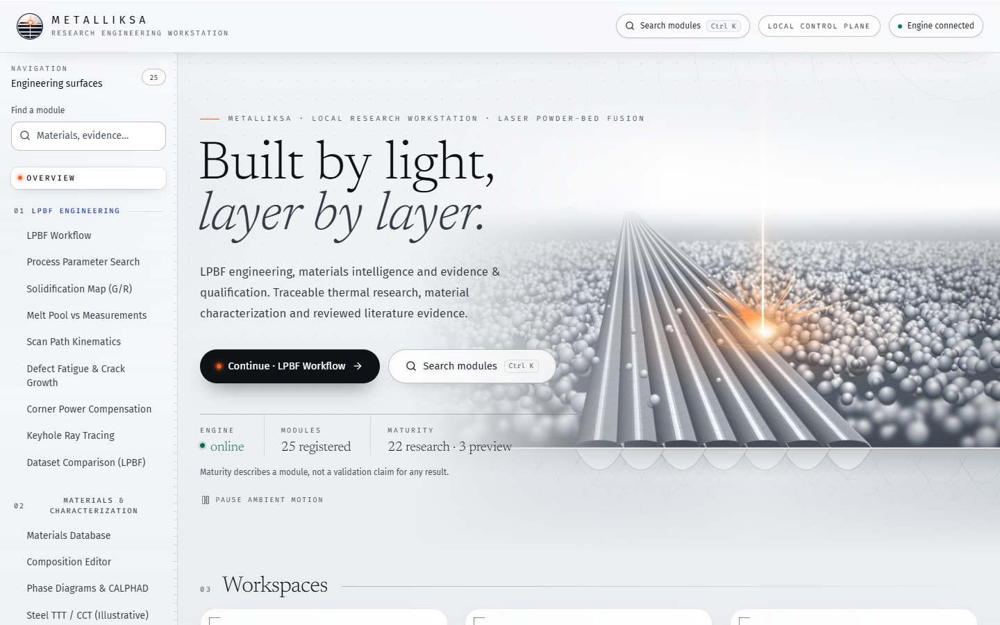

<div align="center">


# Metalliksa

**An open research workstation for LPBF melt-pool and process-window screening, built so every result carries its evidence and limits.**

[](https://react.dev)
[](https://www.typescriptlang.org)
[](https://www.python.org)
[](LICENSE)
[](#evidence-and-limits)

</div>

<p align="center">
  
</p>

<p align="center"><sub>The Overview artwork is an original illustration generated in code, not a simulation result.</sub></p>

---

## What Metalliksa is

Metalliksa is an open research workstation for screening laser powder bed fusion (LPBF) melt pools and process windows. It brings process setup, thermal-model outputs, published-data comparisons, calibration evidence and experiment planning into one traceable workspace.

The aim is to make a screening result inspectable: inputs, material identity, model scope, evidence class and unresolved limits should stay visible alongside it. A map or report helps organize a research decision; it does not establish that a process is suitable for a machine or part.

## What you can do

### Explore a process window

Run a power–speed (P–v) sweep and inspect its decision map, screening regions and the gates that constrain a result. The Core flow connects process setup, window screening, published-data comparison and the calibration scorecard. Specialist tools and other research modules remain under Labs.

### Follow a guided case and export a report

Open the guided NIST IN718 example at **285 W and 960 mm/s**, inspect the inputs and screening output, then export a one-click HTML work report. The preset is a reproducible demonstration case, not a recommended recipe or an experimental validation case. See [STATUS.md](STATUS.md) for the shipped workflow and [src/data/workspaces.ts](src/data/workspaces.ts) for Core/Labs navigation.

### Inspect calibration evidence

The read-only melt-pool calibration scorecard shows how candidate model/material/quantity cells perform against published measurements and why each cell passes or fails its gate. The current scorecard has **no enabled cells**. One within-source-only cell is not a transferable calibration and does not unlock calibrated output. The app does not promote screening labels on the basis of a favorable fit. Details and per-cell evidence are in [the v2 scorecard](docs/LPBF_CALIBRATION_SCORECARD_v2_2026-10-07.md).

### Compare keyhole screening with published measurements

The keyhole benchmark puts the app's existing screening beside published X-ray and other reported measurements, recording digitization uncertainty and unavailable source details. It exposes substantial regime and depth mismatches; it is a comparison report, not a validation result. Read [the benchmark and its methods](docs/LPBF_KEYHOLE_BENCHMARK_2026-10-07.md).

### Plan a next experiment

The experiment planner can prepare a proposed parameter plan, CSV, plate layout and measurement template. Plans are proposals for a researcher to review. User-supplied measurements remain separately identified as measured data; a generated plan is not evidence that an experiment ran. Current planning scope and open choices are tracked in [STATUS.md](STATUS.md).

### Review alloy solidification estimates

The IN718/IN625 segregation view includes literature-derived estimates alongside source scope and caveats. For IN718, the current model reports a gamma/Laves constituent estimate from weld-solidification literature; it is an upper-bound-style screening estimate with a source-composition and process mismatch. A separate local Scheil cross-check is not a measurement and does not agree in every case. The model, values and comparison limits are recorded in [the Scheil/Laves note](docs/LPBF_SCHEIL_LAVES_2026-10-07.md).

## Evidence and limits

**No experimental validation is established by the current LPBF evidence** (`experimentalValidation=false`). The calibration gate currently enables no cells, and the keyhole benchmark reports large depth errors in several comparisons. These limitations matter when interpreting any map, case or report.

The evidence labels describe the source of a result, not a product maturity badge:

| Label | Meaning |
| --- | --- |
| **Measured** | A value supplied by or transcribed from a measurement, with its source and measurement context recorded. This does not automatically mean the model has been checked against it. |
| **Literature estimate** | A value calculated from a published relation or model. Its source process, composition range and assumptions may differ from the current case. |
| **Screening only** | A model output suitable for exploratory comparison under stated assumptions; it has not passed a calibration or validation gate for the current use. |
| **Unresolved / unavailable** | Required evidence, supported scope or input is missing. The workstation should state the gap rather than silently substitute a value. |
| **Calibration-gated simulation** | A label reserved for an explicitly documented, applicable calibration gate. The current LPBF scorecard does not enable a calibrated cell, and experimental validation remains false. |

Software checks establish software behavior. Reproduction of a calculation establishes computational consistency under its inputs. Comparing model output with a published dataset establishes a comparison. None of those alone establishes experimental evidence, transfer to another process regime, or engineering qualification.

### Specific cautions

- The calibration scorecard is a diagnostic gate, not a badge: it currently enables no cells. Several model/depth comparisons show high error; consult the scorecard instead of treating a width fit as evidence for depth.
- The keyhole benchmark evaluates an existing screening classifier against published cases. Its inputs include app-estimated properties and assumptions where source details were unavailable. The report records those gaps and must not be read as experimental validation.
- The IN718 segregation values are literature-based screening estimates. The weld-derived relation is outside its source alloy/process scope for LPBF IN718 and is described as an upper-bound estimate only under specified mechanisms. The local Scheil calculation is a separate, indicative calculation; the two quantities are not directly equivalent.
- The guided IN718 case and process-window map are demonstrations of the workflow. A visually clear region is not an experimentally established process window.

## Data sources, provenance and licensing

Benchmark inputs are kept with manifests, source locators, units and checksums where available. For the NIST AM-Bench archive, the project records files recovered from Internet Archive snapshots of NIST download URLs, then compares local byte counts and SHA-256 hashes with the NIST NERDm record. A matching hash supports byte integrity against that record; it does not prove publisher authenticity, measurement interpretation or model validity. See [data/benchmark/README.md](data/benchmark/README.md) for archive scope, verification commands and unresolved source details.

Some tabular values are transcribed or digitized from published papers and figures. Their source, locator, uncertainty or digitization flag is recorded in the data manifests and benchmark notes. **The papers and publisher PDFs are not redistributed in this repository**; consult each source and its stated license before reuse. The data archive README and each dataset's `LICENSE-ATTRIBUTION.md` describe dataset-specific terms and attribution. Do not assume that the repository's software license also licenses third-party source data.

The optional local `mc_ni` thermodynamic database used in the Scheil cross-check is not committed. Its derivative licensing terms are documented in the Scheil/Laves note and external-data notes; it is not needed by the default LPBF workflow.

### What the archive checks mean

The benchmark verifier checks repository containment, duplicate paths, expected source URL shape, recorded byte counts, local SHA-256 and (for the noted camera files) the leading HDF5 signature. It does not parse every array in a large source file or establish that the publisher's record is authentic. Raw camera signals also cannot be treated as temperature or melt-pool targets without the required calibration, spatial and time mapping, and a reviewed split. The archive guide lists which data are available, absent or restricted to ingestion exercises.

Literature tables can mix printed values with readings taken from figures. The archive marks digitized rows and their locators so readers can tell these apart. A figure-derived value carries reading uncertainty; a printed table entry has the precision and context of its source. Neither should be detached from its alloy, geometry, process conditions or measurement definition when comparing with a solver output.

For the segregation lane, the paper-derived constituent fraction and the local CALPHAD phase amount are different quantities. One includes eutectic gamma with Laves and is reported as a fraction of liquid; the other counts the LAVES phase alone in a local database calculation. The comparison note keeps them side by side for context but explicitly says they are not directly comparable. Do not read the cross-check as an independent measurement or use it to override the literature estimate silently.

## Quick start

You need Node (>= 22.13) and Python 3.11 or 3.12 with the CPU LPBF baseline. For a reproducible Windows CPU setup, use the checked-in CPython 3.12 hash-pinned requirements lock. Other platforms should use the matching lock or the CI CPU-baseline input file as appropriate; GPU, CALPHAD and micrograph stacks are outside this CPU lock.

```powershell
npm ci
py -3.12 -m pip install --require-hashes -r python/requirements-lpbf-win-py312.lock
npm run dev
```

Then open `http://localhost:3000`. The lock's platform and feature scope are documented at its top; see [package.json](package.json) for the available scripts. The guided IN718 demo is available from the LPBF workspace.

## Workstation layout

The browser application provides the navigation, inputs, plots and report export. LPBF solvers and evidence records supply the results; the workstation keeps their scope and provenance with the displayed output. The Core sequence is process setup, process-window screening, comparison with published data, then the scorecard. Labs contains the specialist and materials research modules. Navigation grouping describes where a tool sits in the product, not the evidence strength of its output.

The guided case is opened from the LPBF workspace, while comparisons, calibration evidence and planning each have their own views. Use the scorecard to inspect calibration gates, the benchmark note to understand keyhole comparison methods, and the data archive guide to check provenance. These records are the source of truth for changing results and assumptions; this README provides a short orientation.

Core/Labs is product navigation. The module registry and view mapping define the available screens, and lazy loading is a presentation detail; neither is a maturity ranking or scientific evidence statement. A module can be present and usable while its result remains screening-only or unresolved. Read the label and limitations attached to a result rather than inferring confidence from where the screen appears in the menu.

## Tests and CI

Run the requested local checks from the repository root:

```powershell
npm run lint
npm run test:unit
npm run test:meltpool
npm run build
```

The unit command runs the TypeScript/TSX test glob defined in `package.json`. CI also applies its explicit unit-test exclusion list, installs the CPU LPBF baseline, runs selected Python suites, builds the app and checks bundle budgets. The [CI workflow](.github/workflows/ci.yml) runs on GitHub Actions for pushes to `main`; check the repository's Actions tab for the current result. Passing software tests are software evidence, not physical evidence.

## Contributing and reproducibility

Contributions that improve source traceability, tests, model-scope reporting, benchmark provenance or experiment planning are welcome. Before proposing scientific changes, state the input/output contract, assumptions, source scope and acceptance criteria. Keep measured data, literature values, calculations and synthetic examples distinct; include units, source locators, model/version identifiers and uncertainty where known.

Use the documented benchmark manifests and scripts to verify archived bytes and reproduce derived comparisons. Do not silently adjust a threshold after seeing results, fill missing properties from another alloy, or describe solver output as an independent experiment. Record failed, skipped and unavailable checks alongside successful ones. See [PROOF.md](PROOF.md), [the data benchmark guide](data/benchmark/README.md), and [the LPBF engineering scope](docs/LPBF_ENGINEERING.md) before changing model claims.

When adding a comparison, retain the source file identity and hash, the measurement locator, units, reading uncertainty and any digitization method. Keep training, calibration and held-out evaluation roles explicit. If a required source or measurement is absent, record it as unresolved rather than inferring it from a related alloy or process. A reproducible script and a pinned input make a result easier to inspect; they do not change its evidence class.

## License

The software is released under the [MIT License](LICENSE). Third-party datasets and transcribed source material retain their own attribution and license terms. Solver outputs are research screening results, not qualified engineering data.
