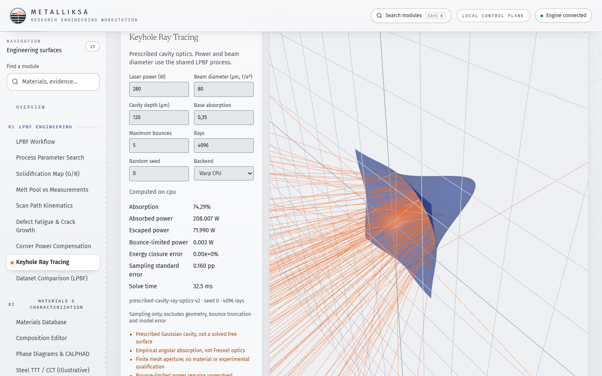
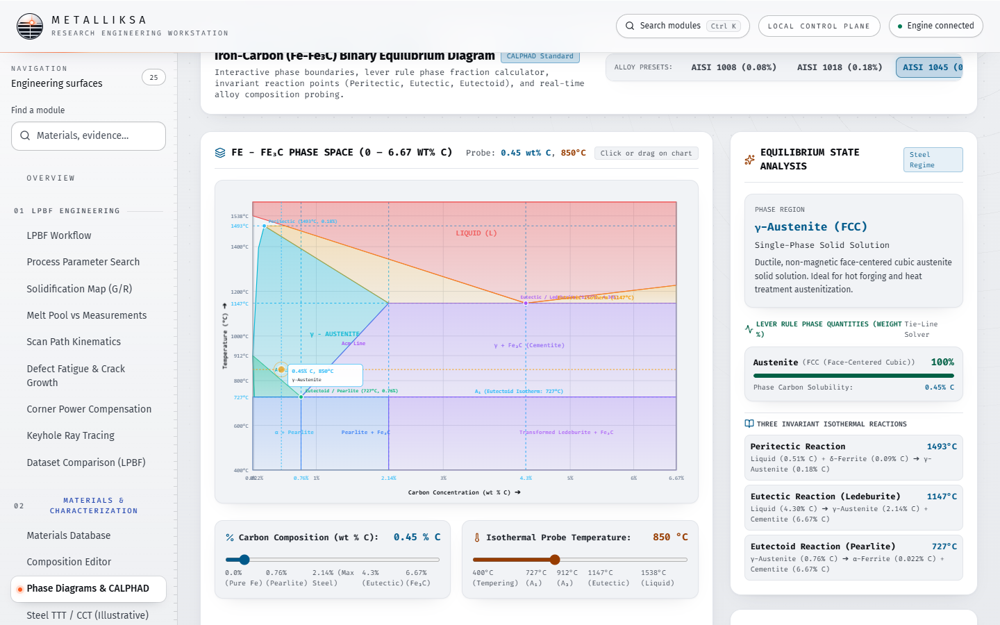
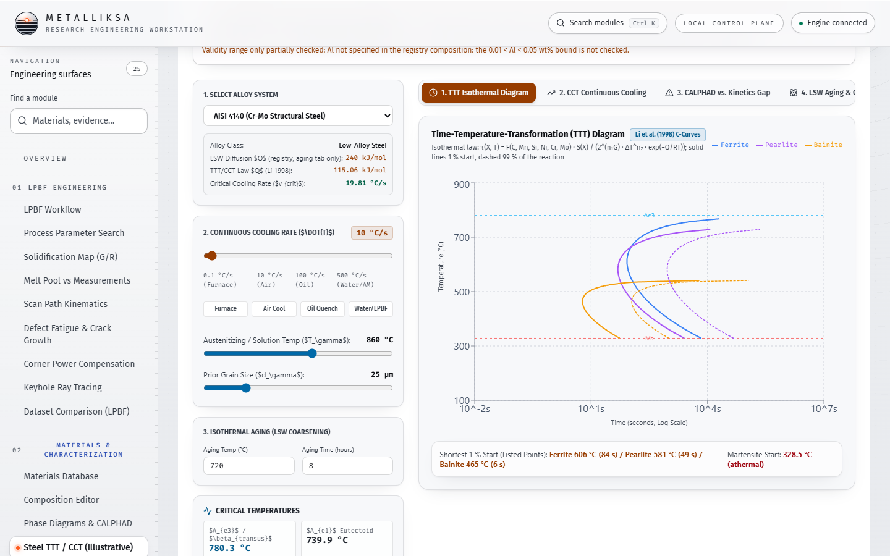
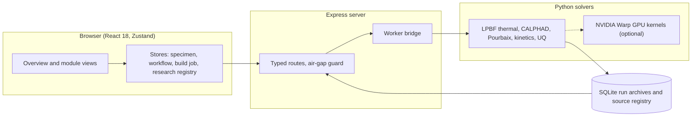
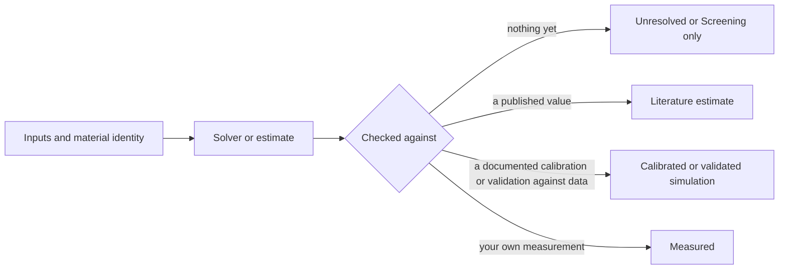

<div align="center">


# Metalliksa

**A research workstation for laser powder-bed fusion and metallurgy, built so that every number knows where it came from.**

[](https://react.dev)
[](https://www.typescriptlang.org)
[](https://www.python.org)
[](#local-first-and-honest-by-design)
[](LICENSE)
[](#evidence-before-claims)

</div>

<p align="center">
  
</p>

<p align="center"><sub>The Overview page. The artwork is an original illustration generated in code, not a simulation result.</sub></p>

---

## What it is

Metalliksa puts the thermal physics of metal additive manufacturing, alloy thermodynamics, corrosion and fatigue screening, and a traceable evidence registry into one local application. It is built for materials and process engineers who need to see not only a result, but its inputs, its model limits and how far it can be trusted.

Most simulation tools hand you a number. Metalliksa hands you the number, the source it rests on, and an explicit label for what kind of evidence it is: measured, validated simulation, calibrated simulation, literature estimate, screening only, or unresolved.

## A look inside

<p align="center">
  
</p>
<p align="center"><sub><b>Keyhole ray tracing</b> in 3D: absorption, absorbed and escaped power and energy closure for a prescribed cavity, on the Warp CPU or GPU backend. Its limits are printed next to the result: a prescribed cavity is not a solved free surface.</sub></p>

<p align="center">
  
  
</p>
<p align="center"><sub>Left: the Fe-Fe3C reference diagram with a lever-rule probe. Right: steel TTT/CCT kinetics. Kinetics are steel-only and labelled illustrative; other alloy classes report <i>unavailable</i> instead of a guess.</sub></p>

Every module states its mechanism, what drives the result, its limits, and the highest evidence level it is allowed to claim.

## How the pieces fit



## How a result earns its label



A result can only be labelled as strongly as the evidence behind it. Passing software checks, or merely comparing against a dataset, never promotes a label by itself.

## What you can do with it

| Area | What is in the box |
| --- | --- |
| **LPBF process physics** | Quasi-steady Rosenthal, Eagar-Tsai and Goldak screening fields, a transient 3D enthalpy solver with a Gaussian source, melt-pool screening, scan-path kinematics, keyhole ray tracing, and build-job screening with a persistent Python worker for long runs. Offline tools for process-map sweeps and powder-layer analysis write their results into `docs/` |
| **Public-data comparison** | An offline harness compares screening-kernel output with published single-track data for 316L and Ti-6Al-4V and reports the gap instead of hiding it; the app shows the committed comparison record. IN718 records are archived but not yet compared numerically |
| **Alloy thermodynamics** | CALPHAD phase diagrams and Scheil solidification on pycalphad with database-scope checks, single-element Pourbaix diagrams (25 °C) from a Gibbs-energy minimisation engine, steel TTT/CCT kinetics (steel only, illustrative) |
| **Properties and fatigue** | Murakami inclusion-based fatigue screening, XRD analysis, an elastic-constants calculator for user-supplied constants, approximate hardness conversions for non-austenitic steels (ASTM E140 / ISO 18265 scope, no extrapolation; tables transcribed from public reproductions), uncertainty quantification on an illustrative strength model |
| **Electrochemistry** | Tafel fitting with explicit fallbacks removed rather than silently substituted, and EIS analysis |
| **Evidence and records** | A research registry linking literature, reviewed numeric findings and module output, with a Build, ProcessParams, Sample, Properties, Source chain |

Every module declares what it can and cannot do through a typed module contract, so unsupported alloys and out-of-range inputs produce an honest *unavailable* instead of a plausible-looking guess.

## Evidence before claims

This project treats scientific honesty as a feature, enforced in code and in tests:

- **Software checks are not validation.** A green test run means the code does what it says. It does not mean the physics matches an experiment. The two are recorded separately.
- **No silent substitution.** Missing material data is never filled in from another alloy. The solver refuses and says why.
- **Frozen physics.** The LPBF implementation is pinned by a fingerprint, with parity goldens for deliberate, reviewable changes only.
- **Illustrative stays illustrative.** Models built on tabulated constants carry that label wherever they appear.

Metalliksa is a research tool. It does not issue production releases, certificates or standards qualification.

## Under the hood

```
React 18 + Zustand + Tailwind 4 (src/)
        |
Express server, typed routes, air-gap guard (server.ts, routes/, server/)
        |
Python solvers: NumPy / SciPy / pycalphad, persistent LPBF worker (python/)
        |
SQLite run archives and source registry
```

- More than **1,300 TypeScript tests** and over **1,200 Python tests** in the CI list, plus bundle-size budgets, a ratcheted dead-code baseline and a ceiling-review check in CI.
- Parity tests keep selected TypeScript ports (for example Pourbaix and the module registry) aligned with their Python counterparts.
- Lazy-loaded modules and a command palette (Ctrl/Cmd+K); a porcelain light theme designed to feel calm for long working sessions.

## GPU acceleration with NVIDIA

Several heavy LPBF kernels (3D transient thermal fields, keyhole and powder-bed ray tracing) have GPU implementations built on [NVIDIA Warp](https://github.com/NVIDIA/warp) and CUDA; some GPU paths use PyTorch CUDA instead. You choose the backend explicitly (`cpu` or `cuda:N`) and there is no silent substitution: an unavailable CUDA device is an error, not a quiet fallback. Keyhole ray tracing also runs on Warp's CPU device, and the powder-bed ray tracer is CUDA-only (if it fails, the thermal solver says so and uses a flat-plate absorptivity). CPU and GPU paths are compared in parity tests that run on machines with a CUDA device and are skipped elsewhere, and GPU-dependent results are labelled as such rather than treated as more accurate.

We also measured where a GPU would not help: for the stochastic UQ engine at the sample counts the app uses (up to 10,000), the model evaluation is a small share of the run time and a Warp port was not worth its start-up cost, so none was added. The benchmark is in `python/tools/uq_warp_benchmark.py`.

The optional micrograph machine-learning features use PyTorch. Metalliksa is an independent project and is not affiliated with or endorsed by NVIDIA; NVIDIA, CUDA and Warp are trademarks of NVIDIA Corporation.

## Local first and honest by design

Everything runs on your machine. An air-gap mode (`AIRGAPPED=1`) blocks outbound calls, and the optional AI features (copilot, micrograph vision, dataset planner) only activate if you provide `OPENAI_API_KEY` on the server.

## Getting started

Requirements: Node 22.13 or newer and Python 3.11 or 3.12.

```bash
npm ci
pip install -r python/requirements-lpbf.in   # CPU LPBF baseline (NumPy, SciPy, pydantic)
npm run dev
```

CALPHAD, micrograph machine learning and CUDA need the full set in `python/requirements.txt` (it pulls PyTorch; install it only if you want those features).

Then open `http://localhost:3000`.

```bash
npm run lint         # type check
npm run test:unit    # TypeScript tests
npm run test:lpbf    # LPBF Python checks
npm run build        # production build
```

## Documentation

- [Product overview](docs/PRODUCT_OVERVIEW.md)
- [Documentation map](docs/README.md)
- [Workstation architecture and workflows](docs/RESEARCH_WORKSTATION.md)
- [LPBF model scope and limitations](docs/LPBF_ENGINEERING.md)
- [Module notes](docs/modules)

## Status

Active development by a single maintainer. The workstation is usable for research screening today; deeper experimental validation of the solvers is ongoing and is tracked openly, never assumed.

## Work with me

Metalliksa is looking for collaborators, research partners and the right engineering team to grow with. If you work on additive manufacturing, computational materials science or evidence-driven engineering software and this resonates, open an issue or reach out:

- LinkedIn: [Muhammet Can Erganis](https://www.linkedin.com/in/muhammet-can-erganis)
- Email: [muhammetcanerganis@gmail.com](mailto:muhammetcanerganis@gmail.com)
- GitHub: [@canerganis](https://github.com/canerganis)

## License

Released under the [MIT License](LICENSE). Note that solver outputs are research screening results, not qualified engineering data; see [Evidence before claims](#evidence-before-claims).
