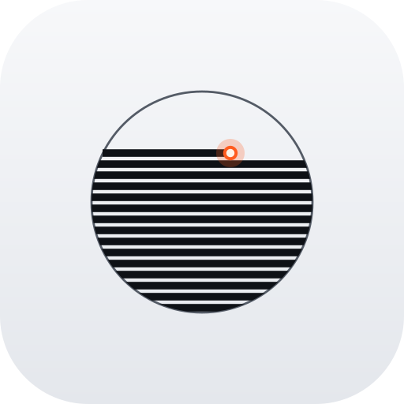

<div align="center">



# Metalliksa

**A research workstation for laser powder-bed fusion and metallurgy, built so that every number knows where it came from.**

[](https://react.dev)
[](https://www.typescriptlang.org)
[](https://www.python.org)
[](#local-first-and-honest-by-design)
[](LICENSE)
[](#evidence-before-claims)

</div>

---

## What it is

Metalliksa puts the thermal physics of metal additive manufacturing, alloy thermodynamics, corrosion and fatigue screening, and a traceable evidence registry into one local application. It is built for materials and process engineers who need to see not only a result, but its inputs, its model limits and how far it can be trusted.

Most simulation tools hand you a number. Metalliksa hands you the number, the source it rests on, and an explicit label for what kind of evidence it is: measured, validated simulation, calibrated simulation, literature estimate, screening only, or unresolved.

## What you can do with it

| Area | What is in the box |
| --- | --- |
| **LPBF process physics** | Transient thermal solvers (Goldak and Eagar-Tsai style heat sources), melt-pool screening, scan-path kinematics, keyhole ray tracing, process-map sweeps, powder-layer analysis, and build-job screening with a persistent Python worker for long runs |
| **Public-data comparison** | A harness that compares solver output with open datasets (316L, Ti-6Al-4V, IN718) and reports the gap instead of hiding it |
| **Alloy thermodynamics** | CALPHAD phase diagrams and Scheil solidification on pycalphad with database-scope checks, Pourbaix diagrams from a Gibbs-energy minimisation engine, steel TTT/CCT kinetics |
| **Properties and fatigue** | Murakami inclusion-based fatigue screening, XRD analysis, elastic constants, hardness conversions following ASTM E140 / ISO 18265, uncertainty quantification |
| **Electrochemistry** | Tafel and EIS fitting with explicit fallbacks removed rather than silently substituted |
| **Evidence and records** | A research registry linking literature, reviewed numeric findings and module output, with a Build, ProcessParams, Sample, Properties, Source chain |

Every module declares what it can and cannot do through a typed module contract, so unsupported alloys and out-of-range inputs produce an honest *unavailable* instead of a plausible-looking guess.

## Evidence before claims

This project treats scientific honesty as a feature, enforced in code and in tests:

- **Software checks are not validation.** A green test run means the code does what it says. It does not mean the physics matches an experiment. The two are recorded separately.
- **No silent substitution.** Missing material data is never filled in from another alloy. The solver refuses and says why.
- **Frozen physics.** The LPBF implementation is pinned by a fingerprint, with parity goldens for deliberate, reviewable changes only.
- **Illustrative stays illustrative.** Models built on tabulated constants carry that label wherever they appear.

Metalliksa is a research tool. It does not issue production releases, certificates or standards qualification.

## Under the hood

```
React 18 + Zustand + Tailwind 4 (src/)
        |
Express server, typed routes, air-gap guard (server.ts, routes/, server/)
        |
Python solvers: NumPy / SciPy / pycalphad, persistent LPBF worker (python/)
        |
SQLite run archives, source registry, evidence records
```

- More than **1,300 automated TypeScript tests** and **1,200 Python tests**, plus bundle-size budgets, a ratcheted dead-code baseline and a CI ceiling-review gate.
- Cross-language parity checks keep the TypeScript ports of the physics aligned with the Python solvers.
- Lazy-loaded modules and a command palette (Ctrl/Cmd+K); a porcelain light theme designed to feel calm for long working sessions.

## Local first and honest by design

Everything runs on your machine. An air-gap mode blocks outbound calls, and the optional AI features (copilot, micrograph vision, dataset planner) only activate if you provide `OPENAI_API_KEY` on the server.

## Getting started

Requirements: Node 22.13 or newer and Python 3.11 or 3.12.

```bash
npm ci
pip install -r python/requirements-lpbf.in
npm run dev
```

Then open `http://localhost:3000`.

```bash
npm run lint         # type check
npm run test:unit    # TypeScript tests
npm run test:lpbf    # LPBF Python checks
npm run build        # production build
```

## Documentation

- [Product overview](docs/PRODUCT_OVERVIEW.md)
- [Documentation map](docs/README.md)
- [Workstation architecture and workflows](docs/RESEARCH_WORKSTATION.md)
- [LPBF model scope and limitations](docs/LPBF_ENGINEERING.md)
- [Module notes](docs/modules)

## Status

Active development by a single maintainer. The workstation is usable for research screening today; deeper experimental validation of the solvers is ongoing and is tracked openly, never assumed.

## Work with me

Metalliksa is looking for collaborators, research partners and the right engineering team to grow with. If you work on additive manufacturing, computational materials science or evidence-driven engineering software and this resonates, open an issue or reach out through the [GitHub profile](https://github.com/0000can0000).

## License

Released under the [MIT License](LICENSE). Note that solver outputs are research screening results, not qualified engineering data; see [Evidence before claims](#evidence-before-claims).
