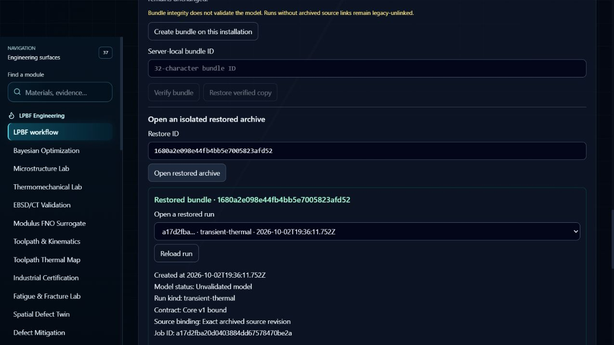

# Bounded CPU workflow and complete bundle inventory

## Scope and revision

The archive correction and this clean workflow replay use commit
`4cb6c39a959d1b72063cec642a64426162a29d96`. Sol 6.1 implemented the inventory
contract; Luna independently reviewed compatibility and added the portable
import cleanup regression. The integration owner ran the combined checks and
the Codex in-app browser flow. No push or new large 5 µm solve was performed.

This record verifies research software behavior. The IN718 workflow case is
not a NIST process match, a physical convergence oracle, or an experiment.
NIST comparison remains unavailable, physical moving-source convergence remains
inconclusive, and experimental validity remains unvalidated. Full V1 exit is
not accepted by this record.

## Complete inventory contract

`verifyRunBundle` checks the exact regular-file inventory in addition to the
existing database, manifest, artifact hash and reference checks. It rejects
unexpected files, including well-shaped unreferenced run/source objects, links,
nonregular files and missing expected files before restore creates its target.
Empty generated directories carry no payload and remain permitted.

The inventory includes every frozen source revision, including revisions not
linked by a run. Legacy v1 bundles with no campaigns and current v2 bundles
remain readable; v1 bundles containing campaigns remain invalid. Backup checks
its content before exclusively publishing the top-level completion manifest.
Standalone source-bundle behavior and schema versions are unchanged.

## Verification at the recorded revision

| Check | Result |
| --- | --- |
| Targeted run/source bundle, API, TAR and UI helper checks | 25 PASS, 0 FAIL, 0 SKIP; 15.231 s |
| Clean locked Node installation | 850 packages; `npm ci --no-audit --no-fund` |
| Clean TypeScript check | PASS |
| Clean full unit suite | 358 PASS, 1 SKIP, 0 FAIL; 80.272 s |
| Clean production build | PASS; Vite 2m48s; existing large chunk warning |
| Existing CPU venv `pip check` | PASS; CPython 3.12.10 / NumPy 2.2.6 |
| Production manufactured-source/diffusion suite | 4 PASS; 16.059 s |
| Separate observational numerical record | 4 PASS; actual step counts and errors retained |
| Isolated graph refresh over three byte-exact owned files | 19 nodes, 68 edges, 3 cards |

The unit skip is the optional CMU source payload (`STMeasurements.csv`,
`MTMeasurements.csv`, `README.txt`); it is not a PASS. The initial offline npm
attempt failed with `ENOTCACHED` for `yallist`. A normal locked retry succeeded;
the install-script policy was preserved and nine allowScripts warnings were
reported. The CPU venv was already separately locked: this session does not
claim a new pip installation. Main repository graph refresh remained unavailable
because of an existing private temporary directory `EPERM`.

### Separate numerical evidence

The four existing tests use manufactured forcing through the production CPU
loop. The observational harness traces only test-method frames; production and
test operators were not edited. Source bytes and canonical implementation ID
were checked before and after. Uniform/nonuniform final temperature error
stayed within `1e-7 K`; the energy ledger bound is `1e-10`.

| Case | Actual accepted steps at its three levels |
| --- | --- |
| Uniform enthalpy ramp | 23 / 38 / 75 |
| Nonuniform enthalpy/operator check | 23 / 38 / 75 |
| Piecewise enthalpy ramp | 34 / 42 / 75 |
| Mixed-boundary diffusion, z cells 8 / 16 / 32 | 47 / 187 / 747 |

Diffusion RMS errors were `5.655962123e-4`, `1.420811566e-4`, and
`3.556297674e-5 K`, with observed orders `1.993057228` and `1.998267238`.
These follow coupled spatial and temporal refinement (`dt ∝ dx²`), not
independent physical LPBF time or mesh convergence. The piecewise case has
separate refinement bounds; the `1e-7 K` uniform/nonuniform bound must not be
applied to all piecewise intermediate samples.

## Real browser workflow

A tracked-source archive contained 1,511 byte-checked files and excluded the
active checkout's unrelated edits, `.env` and existing Node dependencies. Its
production build ran with explicit CPU Python, airgap mode, loopback app/IPC
ports 3027/5067 and 3028/5068, and separate absolute job/run/source/bundle/
research-registry/socket roots. Only test-owned processes were used.

The first in-app browser configured the archived workflow reference:
IN718, Standard / Reference, 60 W, 1200 mm/s, 80 µm beam, 200 °C preheat,
40 µm layer, 20 µm mesh, maximum timestep 1 µs, 600 µm track, one track/layer,
powder surface, 0.2 ms dwell and 0.5 ms cooling. The completed job used 29,988
cells and 2,421 accepted steps in 20.969 s. Energy ledger relative error was
`1.9781934375174158e-15`; this is conservation software evidence.

The browser inspected provenance and limitations, imported the existing local
official optical workbook source, previewed and archived the completed job,
created a portable bundle, downloaded its `.tar`, uploaded it to the second
isolated installation, verified and restored it, then reloaded the page.
The same run, material revision, source binding and Unvalidated model label
remained visible. The second live archive remained empty.

| Identity | Value |
| --- | --- |
| Run/job | `a17d2fba20d0403884dd67578470be2a` |
| Run document SHA-256 | `72e3011710162171af63feca029b7ce0d61b332336a7f2d59c09df078f2436f1` |
| Source dataset / revision | `nist-amb2022-03-optical-xlsx-official-v1` / 1 |
| Source document SHA-256 | `73293ca6c2a1929a2e244f806d6eb5900d4c739716f7f291e74c9bc12dc291b6` |
| Export / import | `4cb53c4b941346dd940ad26807946443` / `4a6ea680df5a4727bc5234cd018fb253` |
| Isolated restore | `1680a2e098e44fb4bb5e7005823afd52` |
| Portable TAR SHA-256 | `7388ceddc08da6945ac50319acb0b715a9785b8863b72140fa0f8c32f54a95bd` |
| Thermal implementation ID | `4cf24334a711ecf6fd41597cb087726580c0ed85b52ece72e0f15b89f6802e35` |

All 75 exported files matched the imported bytes; all 71 run/source objects
matched the restored bytes and their content hashes. Original and restored
run records, metadata and unavailable NIST comparison were exactly equal.
Restore creates new verified SQLite backups, whose container hashes may differ;
this record does not claim restored SQLite byte identity.



## Separate error and recovery checks

- Changing power from 60 to 61 W exposed `Stale · executed snapshot retained`
  in the qualification dossier and the saved-result warning in Thermal.
- Cancelling the 61 W job `ee3fc5aa4f1c41cc8ba4dd354518b3dd` produced no
  `result.json` / `result.tmp`, no result, and no archive/export action. Seven
  partial files (1,079,568 bytes) remained locally and were visibly unverified.
- The 300 W job `6d0784d010454d4ba2c8c27a8a6476d7` stopped at the boiling
  validity limit. Its visible error retained 128 accepted steps at
  `7.73757725e-6 s`, 258 source evaluations, 129 retries and 7,736,904 source
  cell-evaluations. No completed result was published; two partial files
  (479,808 bytes) stayed unverified. This replay exposed a raw transport progress
  frame before the error; the separate worker presentation cleanup is recorded below.
- Malformed bundle acceptance is from actual API/service/TAR checks, including
  successful extraction followed by failed inventory verification, cleanup of
  the private import directory, and unchanged live SQLite bytes. A malformed
  file-picker browser replay was not run.
- Recovery here means reload of a verified isolated restored record. A forced
  worker crash/restart browser replay is still a separate acceptance task.

The CUA download/file-picker calls took 658 s / 4,348 s despite their advertised
timeouts before completing. This is a browser automation limitation; it is not
evidence of application download latency or unattended file-picker reliability.

## Durable evidence and reproduction

The machine-readable [workflow record](LPBF_V1_CPU_WORKFLOW_2026-10-03.json)
has SHA-256 `e0de9f9d62d31d1a5162800fb67a6d98c9beef8971c9f7ee35bb2eb02a03a805`.
The byte-preserved [numerical record](LPBF_V1_CPU_NUMERICAL_2026-10-03.json)
has SHA-256 `86fc67b8819b16b0a99960919eb6daa5d528bc49a4b7289075408fcad8214bad`.
The support directory preserves the full tracked-source hash manifest and the
exact dated observational harness as text. Its original location was
`.tmp-lpbf-bundle-acceptance-20261002/numerical_diagnostics.py`; its fixed
snapshot/output paths intentionally describe this capture, not a generic CLI.
Restore that layout only in a fresh replay workspace and preserve old outputs.

The general clean-install and CPU procedures are
[application reproduction](APPLICATION_REPRODUCTION.md) and
[CPU reproduction](LPBF_CPU_REPRODUCTION.md). The current targeted command is:

```powershell
npx tsx --test tests/lpbf-run-bundle.test.ts tests/lpbf-run-bundle-import-integrity.test.ts tests/lpbf-run-bundle-api.test.ts tests/lpbf-run-bundle-tar.test.ts tests/lpbf-source-bundle.test.ts tests/lpbf-run-bundle-ui.test.tsx
```

## Worker follow-up at a separate revision

Commit `d1cda657e4c1e6e49a524e4d4d9ad17db3d80642` filters only complete, exact,
typed two-key progress frames from nonzero child-exit error summaries. The raw
log is retained; malformed or unrelated JSON, traceback text and CPU failure
diagnostics are preserved. The 4,000-character tail limit is applied after filtering.
This changes the error producer, not numerical physics or its implementation ID.

The root combined worker regression suite passed 20/20, with no skips, in
0.140 s on the authorized Windows runner. The initial sandbox attempt had seven
temporary-directory permission errors; it was not counted as a PASS. Replaying
the saved actual 300 W child log through the formatter retained the full error
and the 128/258/129/7,736,904 CPU counters exactly, without changing the log.
Duplicate keys, huge integers, deep JSON, CRLF and empty diagnostics are covered.
An isolated graph build over the two committed worker/test sources passed:
68 nodes, 206 edges, two cards.

The [worker replay record](LPBF_WORKER_FAILURE_MESSAGE_2026-10-03.json) has
SHA-256 `9cbd4f17b72585d13007872141b603687dcd08e4a3d9336db55b567502b45a0a`.
Its saved input log is preserved in the support directory. This was a formatter
replay, not a new solver/browser run. The clean build, numerical and portable
round-trip evidence above belongs to `4cb6c39`; it is not relabelled as a full
release acceptance of the follow-up revision.

Both recorded acceptance server trees were stopped after PID, command and
creation-time verification. Ports 3027/5067 and 3028/5068 were released; the
test data and logs were preserved. The two test tabs were closed; user NIST
tabs stayed open.

Remaining release work is to replay the latest committed error producer in the
browser and check bounded worker restart/recovery, then repeat the release gates
against one candidate revision before accepting V1.
